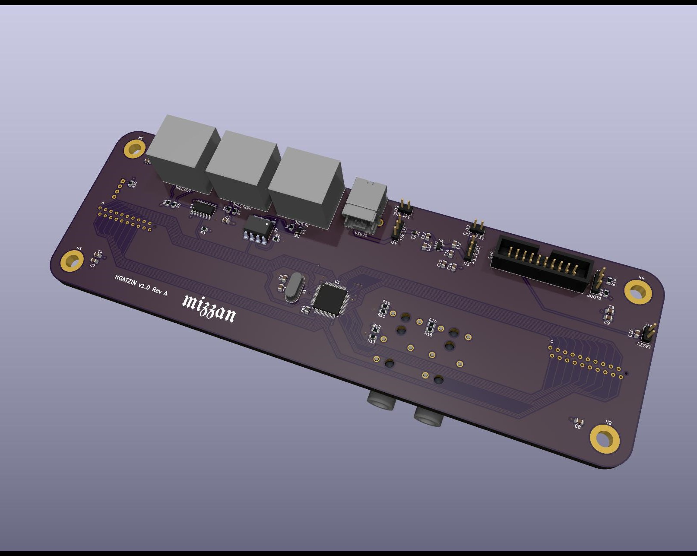

# hoatzin

Hoatzin V1 Rev A from [@mizzan_de](https://twitter.com/mizzan_de) is an encoder for the Fatar 88 keys supporting VFP3/15 3 pedal and aftertouch. The board offers connection over both standard MIDI and USB MIDI.

